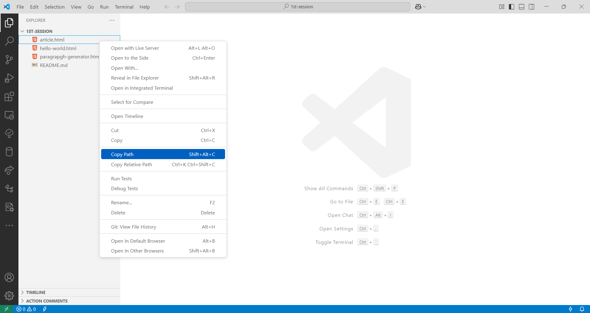
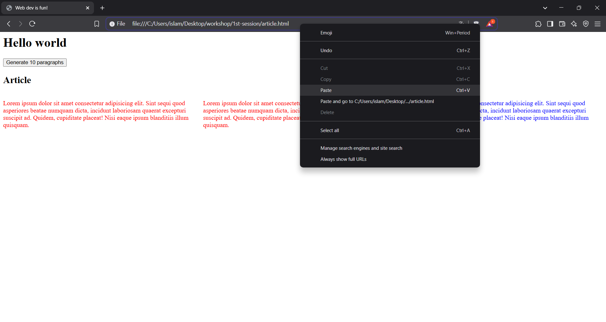

# ورشات ربيع 2025 - Front-end - الجلسة الأولى

## المتطلبات

- اي محرر نصي، يفَضل استخدام Visual Studio Code, [رابط التحميل هنا](https://code.visualstudio.com/download).

## كيفية تشغيل المواقع المرفقة

1. نسخ عنوان ملف الـHTML
   

2. لصقها بالمتصفح
   
